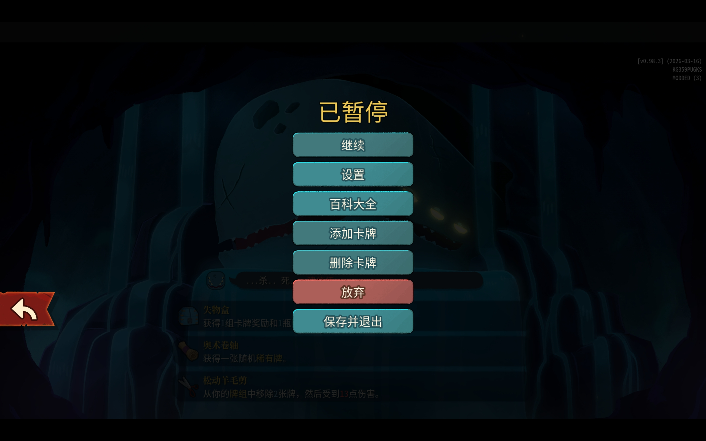
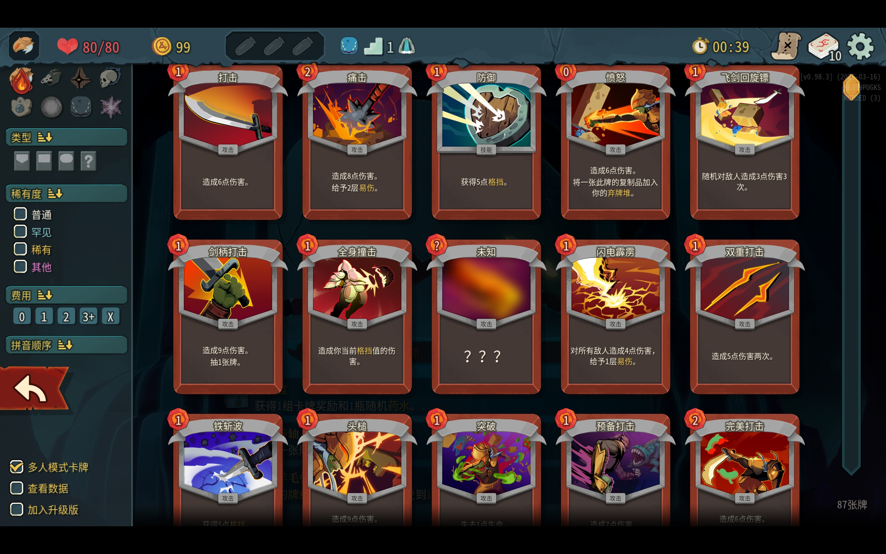

# SlayTheSpire2.CardsAndRelicsChooser

## Feature

- You can add and delete cards and relics in your game.   (Relics waited to be add later, now you can deal with cards.)

- Below is the add page.

  
## How to use it

- Please look at the release page, download the zip file and unzip it, then create a folder named 'mods' in the same directory as SlaytheSpire2.exe (just the root folder) , and place the entire extracted folder inside it.

## References

- `sts2.dll`
- `GodotSharp.dll`
- `0Harmony.dll`
